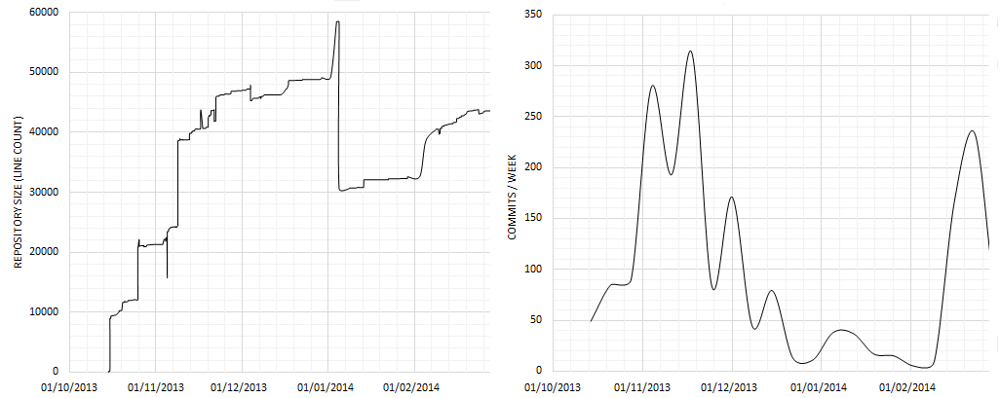

# EE4FYP Midterm Report

Chris Cummins, March 5, 2014.

### Contents

- [Project Aims](#project-aims)
- [Development Methodology](#development-methodology)
- [Development Progress](#development-progress)
- [Outstanding Tasks](#outstanding-tasks)

# Project Aims

The purpose of the project is to develop an online database of
biochemical research data, under the supervision of Professor Ian
Nabney. The data pertains to protein isoelectric points, a property
which has been recorded and reported since the earliest days of
solution biochemistry, and collated from legacy literature by
Dr. Darren Flower and members of Aston University’s Life and Health
Sciences department. The significance of a protein's isoelectric point
is that it corresponds to the solution pH at which the net surface
charge is zero, making the isoelectric point a vitally important
property when both characterising and purifying proteins.

Over the first five months of development, the project has progressed
from an initial specification and concept ideas to a functional and
publicly available application. This document provides a brief
overview of some of the work undertaken in this period, and outlines
the work which has yet to be done. The two primary project
deliverables identified in the initial
[project plan](https://github.com/ChrisCummins/pip-db/blob/master/Documentation/ProjectPlan.md)
were:

1. An updatable relational database warehousing the provided dataset.
2. A web-accessible GUI with searching and downloading functionality.

Since the project's inception, the nature of the first deliverables
has changed subtly. The emphasis on \textit{relational} databases is
less relevant than initially anticipated, since continuing
communications with Dr. Flower has revealed that relations within the
dataset are weak and of little significance, the most important factor
is that the data be stored as a set of documents, with the presence or
absence of relations between them being an implementation detail
rather than a functional requirement. In retrospect this shows that
technical and implementation details should be avoided in the project
requirements if at all possible, since they are a result of
development, and may change throughout the project's lifetime. The 10
[project objectives](https://github.com/ChrisCummins/pip-db/blob/master/Documentation/ProjectPlan.md#objectives)
identified in the project plan are still relevant and remain primary
goals.

# Development Methodology

From the outset, the development methodology has focused around weekly
meetings with Professor Nabney, and regular communication with
Dr. Flower; coupled with a transparent
["bazaar" style](http://www.catb.org/esr/writings/cathedral-bazaar/)
development process. The git version control system has been used to
track all project materials (excluding, at his request, the dataset
provided by Dr. Flower) such as source code and design documents, and
the GitHub website is used to host a copy of the repository. Key
project resources available from the outset include:

 * Public project: http://www.pip-db.org/
 * Repository: https://github.com/ChrisCummins/pip-db
 * Log: https://github.com/ChrisCummins/pip-db/blob/master/Documentation/Log.md
 * Issue tracker: https://github.com/ChrisCummins/pip-db/issues

This open source-centric approach to development also extends to the
tools and software used, with the desire that where possible, effort
should be made to make a positive improvement to the tools used and to
contribute back to the open source community. Currently, I have
contributed to four public projects as a result of this project:

 * watch-less
 * gitstats
 * clojure-koans
 * sqlkorma

Additionally, a number of the tools that have been developed have been
marked as possible candidates for releasing as standalone open source
projects, allowing for re-use outside of this specific project.

# Development Progress

Using the [OpenUP](http://epf.eclipse.org/wikis/openup/) process as a
framework, the first iteration of development was focused upon risk
mitigation. [Risks](https://github.com/ChrisCummins/pip-db/blob/master/Documentation/ProjectPlan.md#risk-assessment)
identified in the elaboration phase were categorised and prioritised,
and the scheduled tasks and activities were focused on mitigating the
most severe of these at an early stage. This meant that the objectives
of the first term work was to get a public and functional prototype
online in as short of a space of time as possible. For this reason,
development of the website began in week 5, after static mockups of
the site's appearance and behaviour had been created and verified by
Dr. Flower. PHP and MySQL were chosen as the languages used in the
prototype implementation, influenced primarily by their low barrier to
entry and speed of development, as opposed to technical merit.

By the end of term, the initial prototype work had been completed, and
a review of the progress was made including user testing with
Dr. Flower. Over the holidays, the choice of languages was
re-evaluated and revised based this time solely on technical merit,
and as a result the website was re-written in Clojure LISP with a
PostgreSQL back-end, and hosted using the free service provided by
Heroku. This re-write enabled a great shift in development effort away
from tooling and managing deployment complexities to instead
innovating and focusing on the core bioinformatics principles of the
project.

One of the benefits of strict version control use is that it provides
an entirely accountable history of development, and analysing the
activity within the repository over the project's life time shows the
early peak in activity starting in TP1 week 5 when work on the
prototype implementation began, and the sharp decline in the number of
lines of code after the Christmas holiday re-write when the website
was re-implemented in the (much more concise) LISP language.

# Outstanding Tasks

With the deliverable website already online and fully functional, the
majority of the remaining development time is dedicated to ironing out
the user experience, and adding extra features which may be helpful to
users. Formal user evaluation trials are planned for week 23, and a
tight feedback loop between development and user testing results from
Dr. Flower and associates will hopefully help produce a product that
is of maximum benefit to it users. Due to the highly specialised field
of interest to which this project appeals, there is no predictable
core userbase, so effort should be made to add suitable user behaviour
tracking and analytics to ensure that the website can be tailored to
best suit the common use cases.

The GitHub issue tracker is used to record all bugs and feature
requests, and core application stability is the primary goal of
development up until user trials in week 23. After which, the focus
will shift towards optimising and future proofing the stack.

