# Review of Iteration 1 Progress

#### 7th October 2013 to 22nd December 2013, weeks 1 to 11.

This first project iteration started with initial research and
investigation and ended with a fully functional working prototype of
the final system. Over 11 weeks, I had 10 meetings with the project
supervisor, 4 meetings with the product owner, and made 1,358 commits
into the project repository, adding 138,899 lines of code and removing
89,887. There were two project milestones in this first term, D1 and
M1.

### Contents
- [Milestones review](#milestones-review)
- [Work Breakdown Structure Review](#work-breakdown-structure-review)
- [Implementation Review](#implementation-review)

## Milestones review

#### D1 review

The D1 [design milestone](ProjectPlan.md#design-milestones) consisted
of early stage design work:

> at this early stage of development, the design should consist of a
> set of non-interactive "paper prototypes" or static renders of the
> application interface, which can be used as a rough guide for
> beginning to prototype the interaction design.

There were 2 non-functional requirements:

> D1.1 - Non-functional - A set of mock-ups for the design of common
> site pages: search page, results page, details page (if applicable),
> advanced search, login page, and upload new data page.
>
> D1.2 - Non-functional - A set of interaction mock-ups for common
> site tasks: searching for a record by protein name, searching
> records from a specific source, searching for records in a pI range,
> performing an advanced search, adding a new record, uploading a new
> dataset.

Both success criteria were met in time for the deadline, with the
[D1 documentation](design/d1/) containing mockups for the pages and
the interaction design that have been generated in Balsamiq.

### M1 review

The M1
[implementation milestone](ProjectPlan.md#implementation-milestones)
involved creating an early working prototype:

> by the end of the first term, breath-first and depth-first
> prototypes of the system which some of the more common user tasks
> should have been implemented, although the underlying software
> architecture and technologies are free to change for the production
> system.

There were 5 requirements which acted as success criteria:

> M1.1 - Functional - A breadth-first prototype which implements
> coverage for the common site pages and tasks.
>
> M1.2 - Functional - A depth-first prototype of the user accounts
> system and data back-end.
>
> M1.3 - Functional - The prototype should allow for potential users
> to interact with a website which implements a limited subset of the
> final functionality, allowing for early feedback on the design.
>
> M1.4 - Non-Functional - An architectural design for the final system
> database.
>
> M1.5 - Non-Functional - A tool to generate fake datasets and upload
> them to the prototype for testing purposes.

Requirements M1.1, M1.2 and M1.3 have been implemented in the
[initial prototype](../www/) work. The architectural design M1.4 has
been generated as a Visio document (pending committing into the git
tree), and the M1.5 tool has been implemented in the *Plausible
Nonsense Generator* [png](../tools/png.js).

## Work Breakdown Structure Review

According to the
[project Gantt chart](ProjectPlan.md#b-project-gantt-chart), there
were 13 activities for this first iteration of development, spread
over an inception, elaboration, and construction phase.

All of the activities from the Gantt chart have been completed by the
end of TP1, but the actual allocation of time has deviated
significantly in some places from what was expected. Notable
deviations from the plan include the resource acquisition phase, which
occurred at a much later time than planned, and the build system
development activity, which started earlier and continued longer than
planned.

In the case of the resource acquisition, the delay was due to the fact
that choosing the project name took longer than expected (see
[issue 16](https://github.com/ChrisCummins/pip-db/issues/16)), as it
was necessary to confirm this choice with Darren in order to decide on
something satisfactory. Additionally, since the PSO supplied server
has it's own URL associated with it, renting a dedicated URL became
less significant. Normal development work could continue uninterrupted
whether I had acquired the resources or not, so it was a low priority.

During the first term, the emphasis of development shifted from
product development towards tooling. As a result of this, work on the
build system began at a very early stage, and much more time was
dedicated to this than anticipated. In addition, much of the work in
the first term was focused around tools development, which isn't
accounted for in the project Gantt chart. This change in project
emphasis and scope is a natural result of the development process, and
could not have been predicted in the project planning stage, since
much of it was based on the results of interactions with Darren.

### Implementation Review

Below is a series of comparison screenshots between the initial D1
designs and the M1 implementation:

#### Homepage
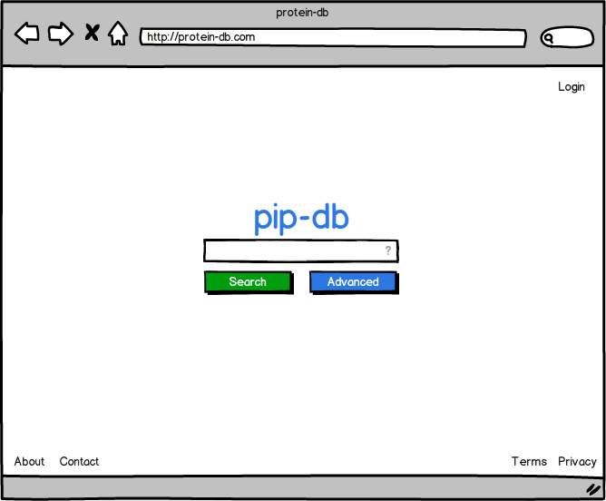
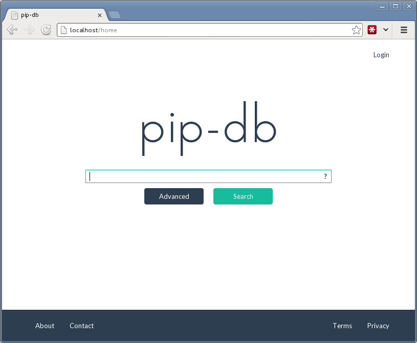

#### Search Results
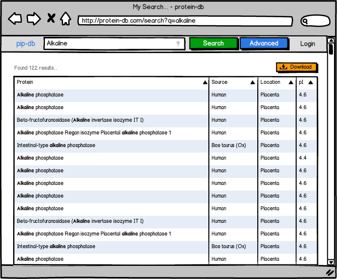
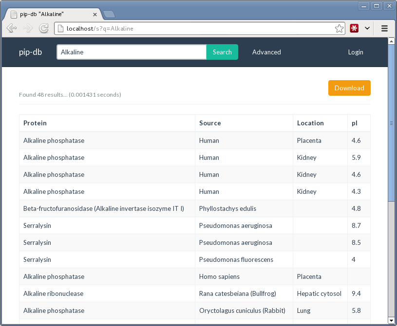

#### Details Page
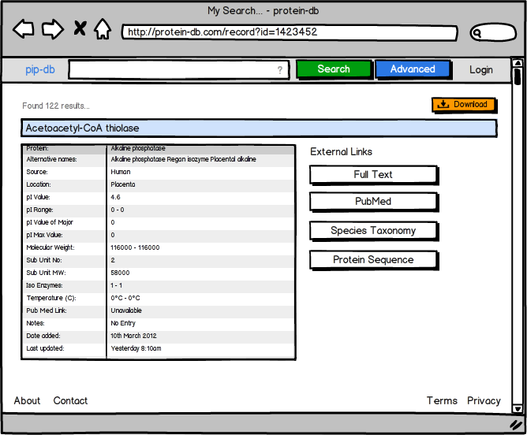
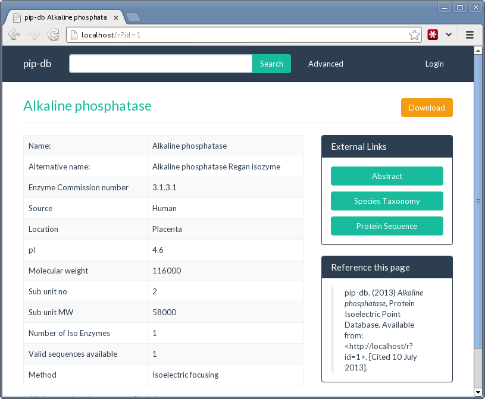

#### Advanced Search
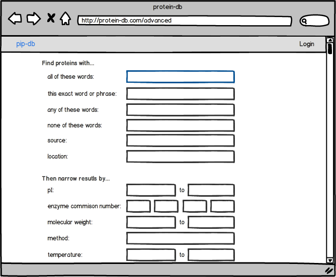
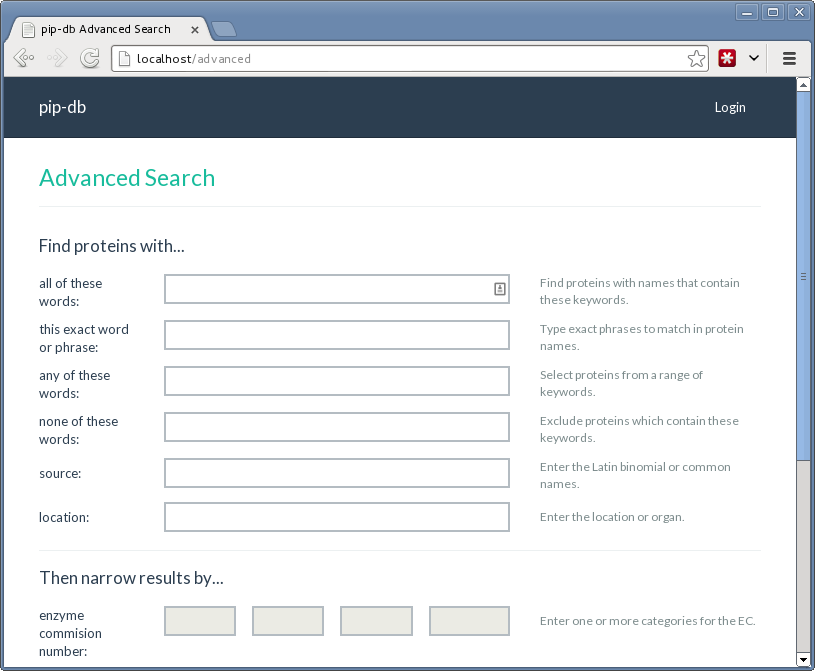

#### Login
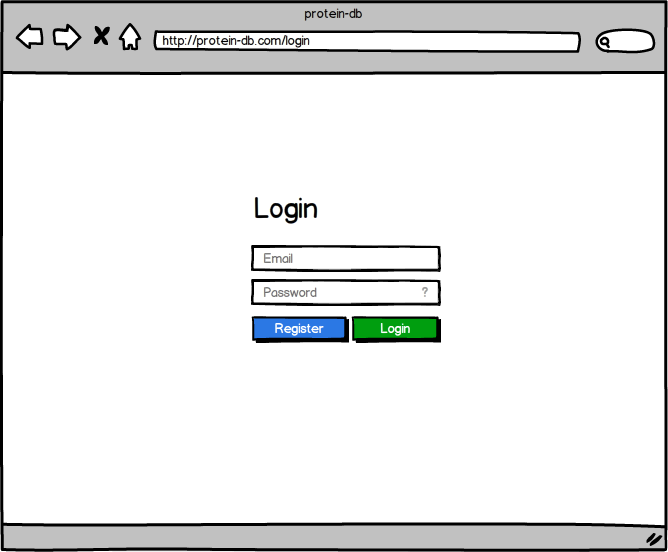
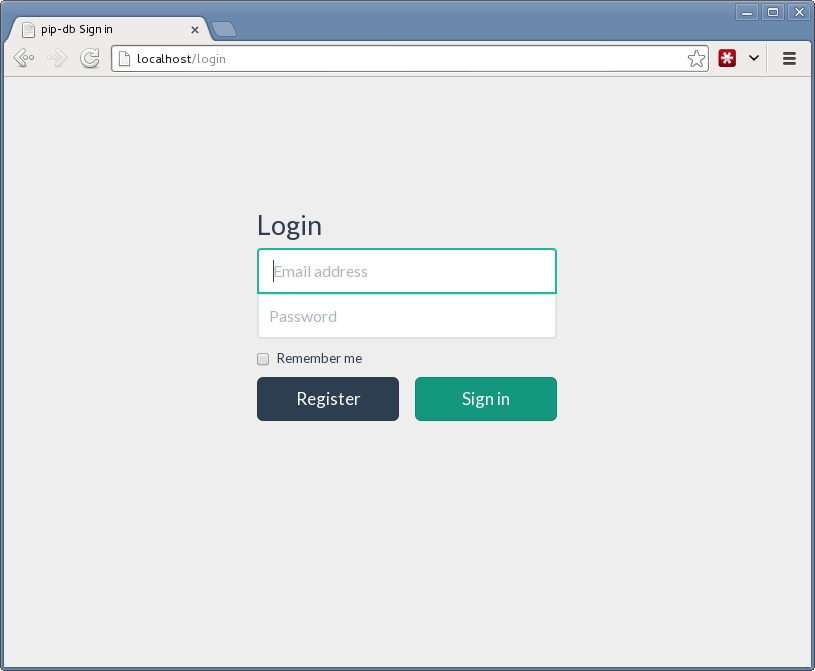

#### Upload New Data
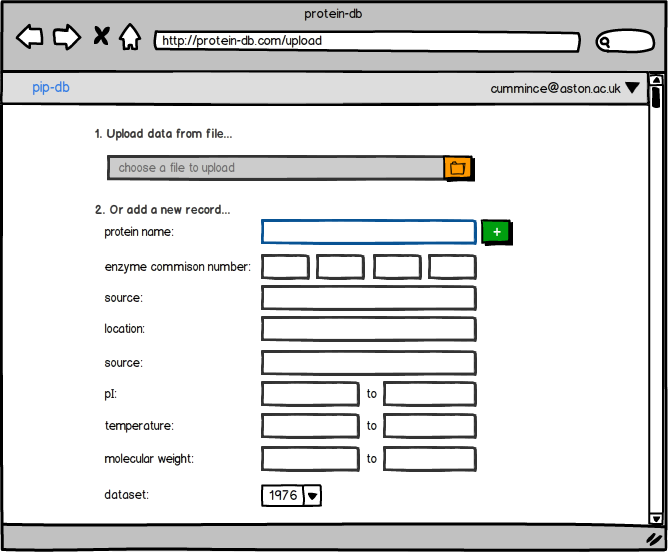
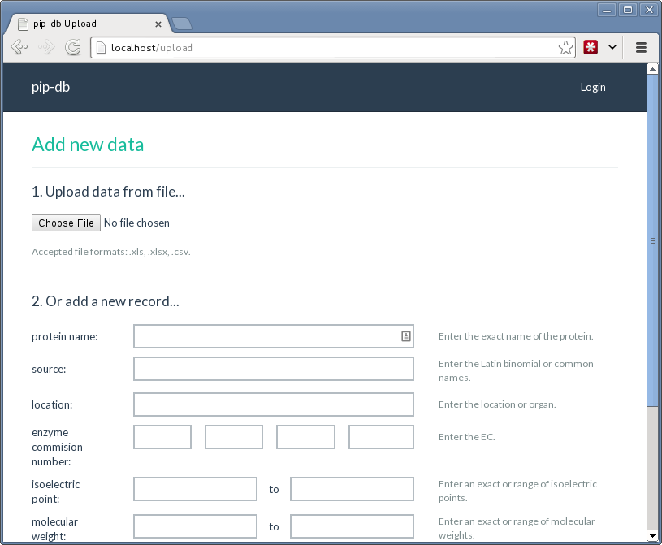
