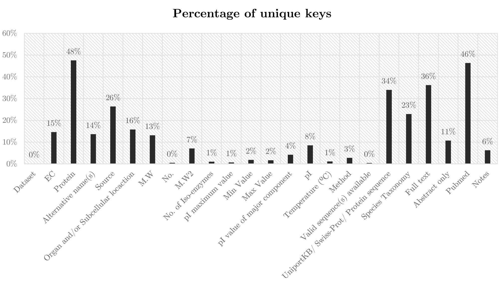
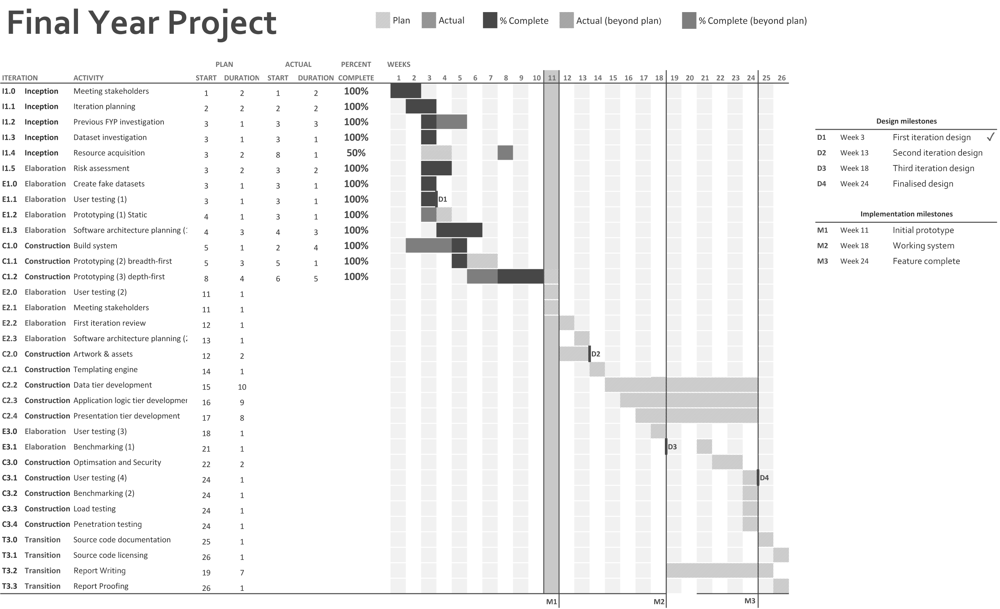

This document contains a proposal and plan to develop a Protein Isoelectric
Point Database as a final year project, under the supervision of Professor Ian
Nabney and based on research undertaken by Dr. Darren Flower and members of
Aston University’s Life and Health Sciences department.

# Introduction

The purpose of the project is to make an intuitive and powerful bioinformatics
search engine which provides online access to a large dataset of protein
isoelectric points which has been compiled by Aston University researchers and
students over the course of several years.

## Background

Bioinformatics is a multidisciplinary field which uses computational methods to
aid in biological research by creating systems for storing, organising and
analysing complex biological data. Within this field there are many online
databases categorising biological information at the molecular level, and one
such purpose of these is for storing the functional and physical properties of
proteins. Currently, no such database exists for one of the most widely-used,
important, and useful properties of proteins: the isoelectric point (pI). An
isoelectric point is the acidity (pH) at which a molecule carries no net charge;
below the isoelectric point, proteins have a net positive charge, above it a net
negative charge. Additionally, proteins are at their lowest solubility at their
isoelectric point, and this makes the isoelectric point a vitally important
property when both characterising and purifying proteins.

The dataset which has been compiled is a collection of entries stored as a
non-relational table, and for each entry it records the name of the protein, its
identity, origin, experimental conditions, its isoelectric point, and other
pertinent data. There are also links to a heterogeneous collection of databases
containing associated data, such as amino acid sequence, function, etc. A
website that warehouses this data and offers a robust and adaptable GUI for
searching, viewing and downloading results would greatly increase the
accessibility of the dataset.

## Objectives

1.  To build a free (as in freedom) web application for searching and viewing
    protein isoelectric points.
2.  To produce a bioinformatics tool with real world value for future scientific
    research.
3.  The application should provide intuitive but powerful searching facilities.
4.  The application should provide a convenient means for a certified user to
    edit and upload additional data.
5.  The application should present information in a usable and efficient form.
6.  Users should be allowed to download generated results for offline use.
7.  Adequate security precautions should be taken to minimise the risk of data
    being sabotaged or stolen.
8.  The implementation should use a clean model view controller architecture.
9.  Comprehensive test coverage of the API and common use cases should be
    automated.
10. The application should be scalable for much larger datasets.

## Deliverables

Two primary deliverables can be derived from the project objectives:

1.  An updatable relational database warehousing the provided dataset.
2.  A web-accessible GUI with searching and downloading functionality.

Additionally, two further deliverables can be derived from the same requirements
document as secondary features:

1.  A web-accessible GUI to support editing and uploading new data.
2.  Support for NCBI BLAST protein sequence matching \cite{NCBIND}.

## Required Resources

The deliverable product for this product is a website that offers a publicly
available service. To this end, there are three required resources:

1.  A server which can be host the website and process and respond to requests
    from clients.
2.  A public IP address which this server can be assigned to for external
    access.
3.  A domain name which will resolve to this IP address.

Additional stipulations for the requirements are that the server should use a
GNU/Linux operating system so as to support most common webserver stacks, and
that it should be a dedicated physical machine with root access so as to allow
for more involved configuration and testing. Assuming that the University can
supply the webserver and access to one of its IP addresses, the budget for the
project need only cover the cost of domain registration, which is very cheap
(less than £20 per year).

## Required Technologies

There are an almost immeasurable number of web technologies that offer the
functionality required to implement this project. From a time-management
perspective, one of the main priorities for the work undertaken in the first
term is to research these existing technologies, and to gain a better
understanding of the strengths of each in order to select an appropriate choice
for the implementation of the final product. Figure [fig:flow-tech-choices]
shows the process by which these choices are made, starting off with the
highest-level decision (the choice of paradigms: whether it be a client-server
model, a distributed network application, the format for data transmission etc.)
and increasing in granularity down to the lowest-level choice of individual
frameworks and libraries. Each decision is not immutable, and previous decisions
may be re-evaluated over time in an iterative fashion. This is to encourage
implementation work to begin at an early stage in order to produce a functioning
prototype, without the need to have performed a depth first analysis of every
possible technology which could be used.  Work on the implementation can begin
once the programming language(s) have been decided upon, so it is important to
reach a decision upon this as early into TP1 as is possible, although this
decision is free to change over the course of the project, providing there is a
realistic justification for this change and adequate time to re-implement any
existing functionality.

A diagrammatic view of the process of adopting technologies
[fig:flow-tech-choices]

## Required Skills

This technically ambitious project will require the adoption of a number of new
skillsets, a brief overview of which is included below:

### Project management

1.  Single-developer project management - including good communication with
    clients and stakeholders, selecting an appropriate software development
    process, setting realistic deadlines and goals, and tracking the progress of
    a long term development project.
2.  Working with a mature codebase - this includes proper version control and
    use of a sane branching model, and documenting decisions and all source code
    throughout the duration of development.
3.  Maintenance and tooling - developing a software product with long-term
    usability as a primary goal, as well as appropriate documentation to allow
    other developers to administrate the website.
4.  Software quality - appropriate use of issue trackers and bug ticketing to
    track the lifecycle of implementation bugs and regressions, and adopting a
    meaningful release cycle and version numbering scheme.

### Back-end development

5.  Relational data modelling and database design - designing and formalising
    database schemas, and providing advanced querying functionality.
6.  Computing with large datasets - appropriately using existing tools and
    software patterns for working with large persistent data models.
7.  Performance optimising - server-side optimisations to enable high
    performance serving of web pages such as caching, and successful cache
    invalidation techniques for the webserver and database.
8.  Designing secure web applications - using formal and established methods to
    ensure data integrity of critical biological research data.

### Front-end development

9.  User interface design - working with clients to design accessible and
    easy-to-user GUIs, including appropriate use of Human Computer Interaction
    techniques and user testing.
10. Responsive website design - correctly using HTML5 and CSS3 features to allow
    for site accessibility from a wide range of different devices.
11. Client-side scripting - using mobile code such as JavaScript to enrich user
    interfaces using technologies such as AJAX and dynamic content generation
    and control.

# Initial Research

The purpose of the initial project research phase is to enable early
identification of risks, design decisions, and other factors which will
contribute to the creation of the project plan.

## Analysis of the Dataset

In order to determine the technical scope of the project it is necessary to
analyse the dataset which the web service will house. The dataset was supplied
by Dr. Flower in the form of a Microsoft Excel spreadsheet consisting of a
single table with 5,773 unique rows over 22 columns. In order to develop a
relational model for this data, each of the 22 unique columns can be considered
as a set of attributes *A1,A2,…,A22* and combined to form a relational schema
*R* (Figure [fig:formal-schema-names-attributes] shows this schema with
attribute names taken from the spreadsheet column headings), with the
spreadsheet values forming an instance of this relation *r(R)* in which each row
can be considered a set of tuples where *t’ = t’(A1),t’(A2),…,t’(A22) $\in$
r(R)*.

    R = {Origin, EC, Protein, Alternative name(s), Source, Organ and/or
    Subcellular locaction, M.W, No., M.W2, No. of Iso-enzymes, pI maximum value,
    pI Min Value, pI Max Value, pI value of major component, pI, Temperature
    (oC), Method, Valid sequence(s) available, UniportKB/ Swiss-Prot/ Protein
    sequence, Species Taxonomy, Full text, Abstract only, Pubmed, Notes}

A formal relation schema with named attributes
[fig:formal-schema-names-attributes]

Each tuple represents a single recording of experimentally-derived data, which
lists the origin of the record (such as a research paper, or academic journal),
and 21 attributes which describe the properties of the protein, the experimental
result and the method used to derive it, and links to relevant online
resources. Figure [fig:chart-dataset-origin] shows a breakdown of the different
origins for all of the records. In order to aid in the design of the database
which will be used to store this dataset, a dataset analysis tool was developed
which parses the dataset file and extracts and derives key information about its
properties, and this information can be used to help determine the best method
to use when storing this data.

A breakdown of the tuple origins within the dataset [fig:chart-dataset-origin]

The number of populated keys for each tuple within the dataset
[fig:chart-dataset-populated]

This early dataset analysis highlighted a number of properties which will
greatly influence the design of the database backend. Chiefly, that the dataset
contains a large number of duplicate keys, and for each tuple, many of the keys
may not be given. This information will have a great influence on the design of
the database; for example, the low percentage of unique values for many of the
records in the dataset indicate that a 3NF normalisation pattern could be used
to gain maximum size efficiency of the stored database \cite{Maier1983}, and so
adequate time should be allocated in the project plan to allow for database
design decisions to be investigated and tested.

The number of unique keys for each tuple within the dataset
[fig:chart-dataset-unique]

## Related Bioinformatics Databases

In addition to gaining a greater understanding of the provided dataset, a
selection of relevant existing websites and databases were examined, in order to
help analyse the strengths and weaknesses of each. As previously stated,
biological databases of protein properties abound, and Dr. Flower’s
bioinformatics research has led to the creation of three such databases:
AntiJen, DSD, and PPD:

**AntiJen** a kinetic, thermodynamic and cellular database
\cite{DDG1999}. AntiJen is a database containing quantitative binding data for
peptides. The database houses over 24,000 entries from published experimentally
determined data, and offers keyword searching of this dataset, with results
being returned in a tabular format.

**DSD** A database of dehydrogenase stereospecificities \cite{DDGND}. DSD offers
a similar set of features as AntiJen but for a different dataset. In addition to
keyword searching, the website supports viewing data by selecting from
categories, and additionally offers BLAST searching, which is a feature that
will be incorporated into this project.

**PPD** Protein pKa Database \cite{DDGNDa}. PPD offers data lookup by either
BLAST search or a detailed search page which allows the user to select from a
given set of criteria, such as protein name, experimental method, and amino acid
name.

In each of the websites, a large dataset of very specific biological data is
hosted on a website which offers a service for members of the public to query
certain aspects of it and return results. In each case, it is only possible to
return a reduced subset of the data, with no ability for users to download the
entire set in one go; the idea being that users should be allowed to answer
specific queries they may have, but not to idly download the entire dataset
which may be the result of many years of researchers’ work. From a technical
standpoint, the websites appear lacking in some areas such as user interface
design, where their rather dated aesthetic and design leads to a rather poor
user experience. Of course this has no bearing on the usefulness of the service
and data offered by the websites, but a greater level of ease of use and control
over the format in which search results are displayed could lead to a more
engaging experience for the user, as well as allowing them to attain the data
they need in a more efficient manner.  To this extent, common Human Computer
Interaction and web design principles should be applied when formulating the
design of the website.

## Previous Final Year Project Analysis

In addition to the existing public bioinformatics databases which Dr.  Flower
assisted in creating, students from previous years have attempted to develop a
similar project to this one. Chief among these was an earlier implementation of
a protein isoelectric point database, created by former student Mohammad
Abdullah. The project used an older and reduced-size version of the current
dataset, and used a MySQL database to store the data, with a PHP back-end to
query the tables and generate static HTML webpages which can be served over an
Apache webserver. A technical review of the implementation revealed a number of
things that could be improved upon - largely that the codebase is a somewhat
impenetrable mixture of PHP with inline HTML, with no distinction between the
application logic and presentation tier, and the querying mechanism is quite
primitive, with little ability to perform advanced searching within the
dataset. Appendix [appendix:previous-fyp-uml] contains a UML diagram of the
database schema used, which highlights the small number of tables used, with few
relational links between records leading to a simplistic searching mechanism. As
identified in the initial dataset analysis, using a more normalised design could
result in a more compact database and allow for more in-depth searching of
results.

# Risk Assessment

Table [tab:risk-assessment] lists some of the potential project risks that were
identified during the initial research phase which could influence the success
of the project and its ability to meet the objectives and deliverables. For each
risk, the probability of it occurring and impact it would have on the project
have been assigned a value between 1 and 5 to indicate their magnitude.

**Risk** & **Description** & **Category** & **Probability** &
**Impact**\
R1 & Design is not intuitive & Design & 2 & 3\
R2 & Project involves use of new technical skills & Development & 5 & 5\
R3 & High Level of technical complexity & Development & 5 & 3\
R4 & Complex deployment of production website & Development & 5 & 4\
R5 & Project milestones not clearly defined & Planning & 1 & 1\
R6 & System requirements not adequately identified & Requirements & 2 &
5\
R7 & Change in project requirements during development & Requirements &
1 & 5\
R8 & Changes in dataset format during development & Resources & 2 & 5\
R9 & Unable to obtain required resources & Resources & 1 & 1\
R10 & Users not committed to the project & Users & 2 & 4\
R11 & Lack of cooperation from users & Users & 1 & 4\
R12 & Users with negative attitudes toward the project & Users & 1 & 2\

A list of potential project risks and their severity
[tab:risk-assessment]

## Mitigation Strategies

For each of the risks discovered in the assessment, mitigation strategies have
been defined which provide techniques to avoid or minimise the threat of each
risk.

**Risks** & **Description** & **Mitigation Strategy**\

**Risks** & **Description** & **Mitigation Strategy**\

3r*Continued on next page…*

R1 & Design is not intuitive & The key to mitigation of this risk is in frequent
and effective user testing and an understanding of typical and common use-cases
for the product.\

R2 & Project involves use of new technical skills & In order to prevent this
risk from having a serious impact on the project, it will be necessary to begin
studying and reading about the technologies that will be used at a very early
stage in the project, long before the start of the implementation.\

R3 & High Level of technical complexity & Avoiding this risk will involve
ensuring that the scope of the project remains technically feasible, and that
the software architecture is abstracted into small enough units that it is
easier to focus on each one separately, as well as keeping small iterative
development cycles and adequate test coverage to prevent regressions when
implementing new functionality.\

R4 & Complex deployment of production website & A website with independent data
and application logic components can result in an intricate deployment
process. This is a common problem in the development of complex web application,
where development and production environments must be synchronised and
differences between debugging and releases builds must be accounted for. In
order to mitigate this risk, a suite of tools to configure, build and deploy the
website should be developed at an early stage, allowing for fast deployment of
public releases.\

R5 & Project milestones not clearly defined & A thoroughly described and well
thought out project plan will help to prevent scheduling issues and delays in
development that would arise from this risk.\

R6 & System requirements not adequately identified & A comprehensive
specification of the finished product before implementation begins will help to
mitigate this risk.\

R7 & Change in project requirements during development & An agile approach
towards accommodating for changes in the requirements should be used so as to
keep the time between user feedback sessions and input from stakeholders low.\

R8 & Changes in dataset form at during development & It is not possible to
entirely avoid this risk due its nature and the dependence on third parties, but
steps can be taken to prevent any delays that this would cause, chiefly, a well
abstracted data parsing component which can be switched and modified if
necessary to accommodate for a new dataset format.\

R9 & Unable to obtain required resources & Since the project does not require
many resources, it is important to acquire these as early on in the development
process as possible, and alternative resources should be planned for, such as
local test servers.\

R10, R11, R12 & Users not committed to the project, lack of cooperation from
users, and users with negative attitudes toward the project & The usefulness of
the finished project will depend largely on ensuring that the needs of the users
are considered the primary goals of the design.  Violating this principle may
cause disillusionment from the people who are volunteering their time to assist
in the project.\

Risk mitigation strategies
[tab:mitigation-strategies]

# Development Process

The software development process used for this project is based the Open Unified
Process (OpenUP), a part of the Eclipse Process Framework \cite{EclipseND}. The
reasoning behind this choice is that, as a Rational Unified Process derivative,
OpenUP offers an open source process framework which is targeted at agile
development in small teams and provides a number of development phases and
activities which can be used when designing the project plan (Figure
[fig:sequence-openup]).

A sequence diagram showing a single full iteration of the OpenUP process
[fig:sequence-openup]

## Work Breakdown Structure

The crux of OpenUP is in breaking down a large development project into four key
phases to iterate on: the Inception Phase, Elaboration Phase, Construction Phase
and Transition Phase \cite{Rational2011}.

**Inception Phase** The inception phase represents the initial work which
defines the scope and objectives of the project. Key tasks include generating a
list of the core product’s requirements, key features and main constraints, and
developing an understanding of the general product use-cases and business
case. The work in this phase culminates with a stakeholder concurrence on the
project scope, cost and schedule, and a deep requirements understanding which
covers the depth and breadth of the technical work to be undertaken. For this
project, the inception phase should include meeting all project stakeholders and
research into existing protein databases, their use-cases, and a deeper
understanding of the scientific value of the dataset.

**Elaboration Phase** The elaboration phase builds upon the work done in the
construction phase by requiring deeper technical research into required
technologies, and initial prototyping of early ideas. By the end of the
elaboration phase, the product vision should be agreed upon and stable, and a
full plan of the technical architecture should have been reached. Further
iterations of the elaboration phase may be used after construction has begun to
refine the architecture plan, or as a response to a change in the technologies
used. The purpose of the phase is to turn the initial product vision into a
realisable goal with quantifiable and achievable goals and objectives. For this
project, the elaboration phase will involve investigation into some of the
available technologies (PHP, MySQL, Node.js, MongoDB, etc.), and technical
prototypes of the database backend.

**Construction Phase** The construction phase covers the development of the main
software architecture and associated documentation, and should result in
“Initial Operational Capability” \cite{Rational2011}. Success criteria for this
development phase includes whether the product is mature enough to be deployed
to users, and so for this project will require meeting with stakeholders to
ensure that the implementation of the plan is acceptable.

**Transition Phase** The transition phase includes beta testing of the new
system against user expectations, and includes a review of the completed product
against the requirements and objectives established in the initial project plan
to measure success. The phase culminates in a product roll-out and any
associated distribution, marketing, and training of users that is required. For
this project, it will involve deploying the finished project to a public server
and conducting extensive user testing.

## Version Control

A revision control and source code management (SCM) system will be used during
all development to keep an auditable and transparent log of progress, and Git
will be used for this. There are numerous advantages that Git has over other
SCMs, chiefly that it is entirely open source and GPL licensed \cite{FSF1991},
it has a very lightweight branching model and good support for rebasing and
merging, and there are numerous sources which offer free hosting of open source
licensed projects that are tracked by Git. A public repository of the source
code and all relevant documentation for this project is available on GitHub
\cite{Cummins2013}.

### Issue Tracker

One of the additional benefits of the GitHub online repository hosting service
is that it supplies a number of useful tools, namely an issue tracker and
milestones list. This allows issues to be created online and categorised
appropriately (e.g. bugs, tasks, regressions, documentation, etc.), and then
referenced from the repository commits. Milestones can be created and individual
issues assigned to them, allowing for quick and visible progress checking of
development towards a specific goal.

### Test Driven Development

By combining the available issue tracker with good version control practises, it
is possible to implement a simple and functional test driven approach to
development (Figure [fig:flow-tdd]). This breaks down the development process
into single-issue chunks, with each iteration beginning with creating a local
development branch for an issue and then writing failing test cases which can
then be patched. Using this model of development ensures that all work
undertaken is relevant to the project and directly affects progress, minimising
the amount of time wastage and increasing the stability of the codebase by
ensuring adequate test coverage \cite{Martin2011}.

A single iteration of the project’s test-driven development workflow
[fig:flow-tdd]

# Project Schedule

The project development is spread over a 26 week period, with 11 weeks in the
first teaching period and the remaining 15 in the second. In order to maximise
the effectiveness of this time, a list of tasks for each of the four OpenUP
development phases was constructed, and a time allowance associated with
each. The final project plan consists of 8 phases: the inception phase and
transition phases, and four iterations of elaboration and construction. The
smaller elaboration and construction cycles were used so as to maximise the
allowance for changes in the project specification caused by user feedback and
review without causing delays in the development. This is to minimise the impact
of the “Change in project requirements during development” risk (R7, see page
tab:risk-assessment). Once the list of tasks was assembled, a Gantt chart
(Appendix [appendix:project-gantt-chart]) was constructed which ordered each of
these tasks and distributed them across the timespan. Careful ordering of the
tasks ensured that there is the least chance for blocking between activities,
where one task runs over the specified time allowance and causes later tasks to
be postponed until it’s finished. The final project plan allows for the maximum
amount of parallel activities and development by ensuring that there are
adequate gaps between activities that depend on each other.

## Milestones

In order to provide a running measure of success for the project, a set of
milestones were defined which track the development process from inception
through to transition and provides completion deadlines for a set of
activities. Two types of milestones are used: design and implementation.

Design milestones cover the design of the user interface, such as the “look and
feel” of the project, and the interaction design. Each design milestone is
preceded by a round of user testing, in which feedback and opinions can be
gathered by the project stakeholders in order to influence the next iteration of
design.

The implementation milestones cover the technical development, with each
milestone marking a set improvement in the implementation of the backend,
frontend, and controller, from the initial prototyping phase to the “feature
complete” endpoint. Unlike the design milestones, the implementation milestones
are less reliant on input from third parties and so are more a personal measure
of my own development; however they have a great value in providing exact dates
to complete the implementation of features by, allowing for early sub-system
testing and providing adequate time for final product validation.

For each milestone, a set of requirements has been created which can be used as
success criteria for deciding when a milestone has been achieved. The
requirements of the milestones are cumulative, meaning that requirements for the
final milestone of each type includes all of the requirements of the previous
milestones of that type. The requirements have been split into functional and
non-functional requirements, where functional requirements describe the
behaviour and functionality of the product, and non- functional requirements
describe the criteria which can be used to judge the functional behaviour.

### Design Milestones

**D1 First iteration design (week 3)** at this early stage of development, the
design should consist of a set of non-interactive “paper prototypes” or static
renders of the application interface, which can be used as a rough guide for
beginning to prototype the interaction design.

**ID** & **Type** & **Description**\

D1.1 & Non-functional & A set of mock-ups for the design of common site
pages: search page, results page, details page (if applicable), advanced
search, login page, and upload new data page.\

D1.2 & Non-functional & A set of interaction mock-ups for common site
tasks: searching for a record by protein name, searching records from a
specific source, searching for records in a pI range, performing an
advanced search, adding a new record, uploading a new dataset.\

D1 milestone requirements [tab:d1-requirements]

**D2 Second iteration design (week 13)** the user interaction design should be
the primary focus of this second iteration, with many of the common tasks
(searching for a result, looking up a record, etc.) being more tightly defined.

l l p12cm

**ID** & **Type** & **Description**\

D2.1 & Functional & An interactive prototype which implements common
site tasks: logging in and out using credentials, searching for a record
by protein name, searching records from a specific source, searching for
records in a pI range, performing an advanced search, adding a new
record, uploading a new dataset.\

D2.2 & Non-functional & A set of interaction mock-ups for ‘edge case’ or
uncommon events: an error on the server-side, performing a search which
returns no results, attempting to log in with incorrect credentials.\

D2 milestone requirements [tab:d2-requirements]

**D3 Third iteration design (week 18)** by the third iteration, the interaction
design should be complete, allowing the focus of development to be placed on
polishing the look and feel of the application and establishing a common
aesthetic style.

**ID** & **Type** & **Description**\

D3.1 & Functional & An interactive website which implements the full
interaction design.\

D3.2 & Non-Functional & A set of revised mock-ups for the aesthetic
design of all site pages.\

D3 milestone requirements [tab:d3-requirements]

**D4 Finalised design (week 24)** this last design milestone marks the endpoint
of all design changes, and can be used to review the quality and effectiveness
of the fully evolved product.

**ID** & **Type** & **Description**\

D4.1 & Functional & An interactive website which implements the full
aesthetics and interaction design, providing 100% coverage of all
interactions and scenarios described by the mock-ups.\

D4 milestone requirements [tab:d4-requirements]

### Implementation Milestones

**M1 Initial prototype (week 11)** by the end of the first term, breath-first
and depth-first prototypes of the system which some of the more common user
tasks should have been implemented, although the underlying software
architecture and technologies are free to change for the production system.

**ID** & **Type** & **Description**\

M1.1 & Functional & A breadth-first prototype which implements coverage
for the common site pages and tasks.\

M1.2 & Functional & A depth-first prototype of the user accounts system
and data back-end.\

M1.3 & Functional & The prototype should allow for potential users to
interact with a website which implements a limited subset of the final
functionality, allowing for early feedback on the design.\

M1.4 & Non-Functional & An architectural design for the final system
database.\

M1.5 & Non-Functional & A tool to generate fake datasets and upload them
to the prototype for testing purposes.\

M1 milestone requirements [tab:m1-requirements]

**M2 Working system (week 18)** by week 18 the software architecture and choice
of technologies should have been fully realised, and the functional backend of
the majority of use-cases should have been implemented, along with good test
coverage of each.

**ID** & **Type** & **Description**\

M2.1 & Non-Functional & A software design which stipulates the final
decision on which technologies will be used.\

M2.2 & Non-Functional & An architectural design which covers the full
model view controller stack and components of each.\

M2.3 & Non-Functional & A test harness and accompanying automated unit
tests with full coverage of the API under common states.\

M2 milestone requirements [tab:m2-requirements]

**M3 Feature complete (week 24)** the feature complete milestone marks the end
of the development of new features. By this point, the system should be fully
functional and optimised, allowing for final stress and load testing to take
place, and for the system to be deployed.

**ID** & **Type** & **Description**\

M3.1 & Functional & A secured server which is publicly accessible from a
domain name.\

M3.2 & Functional & An optimised software stack which can serve pages
within a determined time limit.\

M3.3 & Functional & A software architecture which can support datasets
of up to a million records.\

M3.4 & Non-Functional & Full test coverage of the API and automated
black-box testing of the common website tasks.\

M3.5 & Non-Functional & The source code should be available online and
licensed with an appropriate open source license.\

M3.6 & Non-Functional & Full documentation coverage of the internal
API.\

M3 milestone requirements [tab:m3-requirements]

# References

NCBIND National Center for Biotechnology Information. About NCBI. NCI.  [Online]
ND. [Cited: 31st October 2013.]  <http://blast.ncbi.nlm.nih.gov/Blast.cgi>.

Maier1983 Maier, D. The Theory of Relational Databases. Computer Science press,
1983.

DDG1999 Drug Design Group. AntiJen Database: Homepage. AntiJen. [Online]
1999. [Cited: 10th December 2013.]
<http://www.ddg-pharmfac.net/antijen/AntiJen/antijenhomepage.htm>.

DDGND Drug Design Group. DSD: dehydrogenase stereospecificities
database. DSD. [Online] ND. [Cited: 10th December 2013.]
<http://www.ddg-pharmfac.net/dsd/DSD/dehydrog.htm>.

DDGNDa Drug Design Group. PPD database. PPD a database of protein ioinization
constants. [Online] ND. [Cited: 10th December 2013.]
<http://www.ddg-pharmfac.net/ppd/PPD/pKahomepage.htm>.

EclipseND The Eclipse Foundation. OpenUP. Introduction to OpenUP.  [Online]
ND. [Cited: 31st October 2013.]  <http://epf.eclipse.org/wikis/openup/>.

Rational2011 Rational. Rational Unified Process - Best Practices for Software
Development Teams. IBM. [Online] November 2011. [Cited: 21st October 2013.]
<http://www.ibm.com/developerworks/rational/library/content/03July/1000/1251/1251_bestpractices_TP026B.pdf>.

FSF1991 Free Software Foundation, Inc. GNU General Public License, version
2. GNU Operating System. [Online] June 1991. [Cited: 31st October 2013.]
<http://www.gnu.org/licenses/gpl-2.0.html>.

Cummins2013 Cummins, C. pip-db: Bioinformatics search engine for protein
isoelectric points. GitHub. [Online] 14th October 2013. [Cited: 31st October
2013.] <https://github.com/ChrisCummins/pip-db>.

Martin2011 Martin, R. C. Agile Software Development, Principles, Patterns, and
Practices. Pearson, 2011.

# Project Gantt Chart

[appendix:project-gantt-chart]

Previous Final Year Project Database Design
===========================================

[appendix:previous-fyp-uml]

